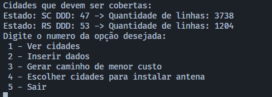
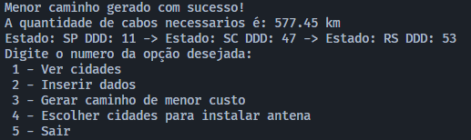
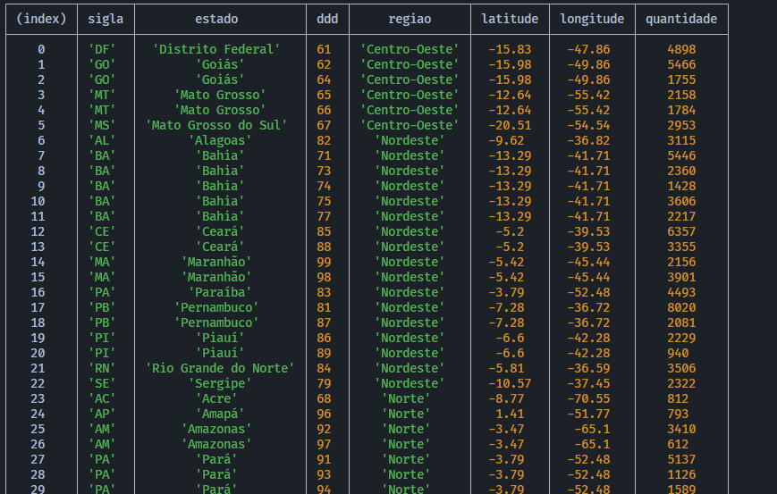

# Final_TelecomDDD
## Alunos
| Matrícula  | Aluno        |
| ---------- | ------------ |
| 19/0024950 | Arthur Melo  |
| 18/0105604 | Luis Marques |

## Sobre 
Projeto para auxilio na prototipagem de linhas telefonicas moveis

## Screenshots

## Instalação 
**Linguagem**: Javascript 
**Framework**: node 
Descreva os pré-requisitos para rodar o seu projeto e os comandos necessários.

## Uso 
Execute o Comando :
        node index.js

